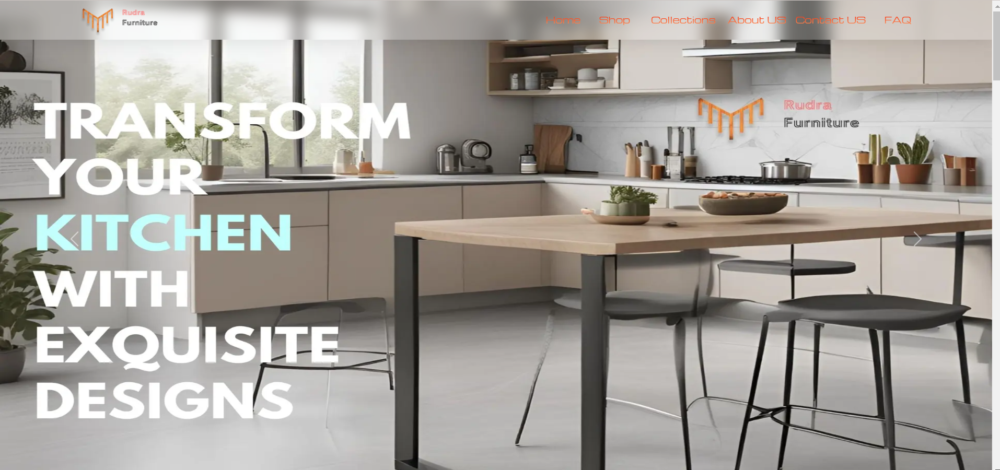
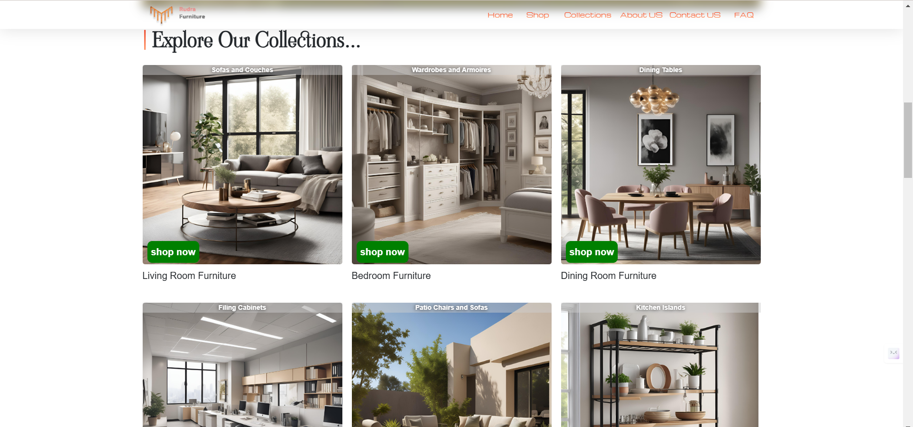
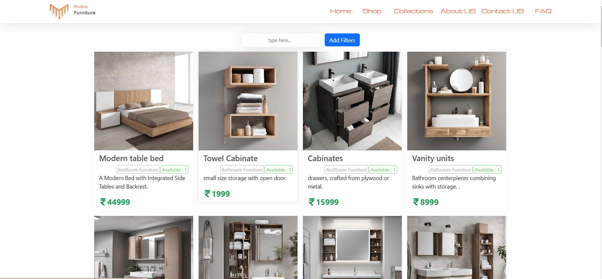
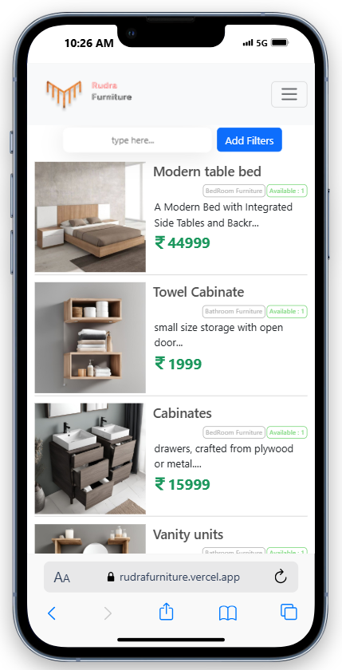
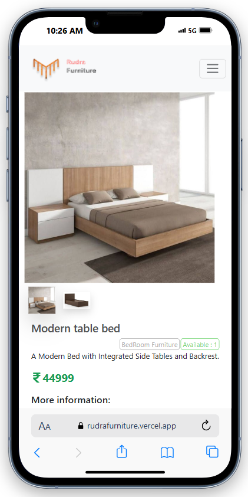
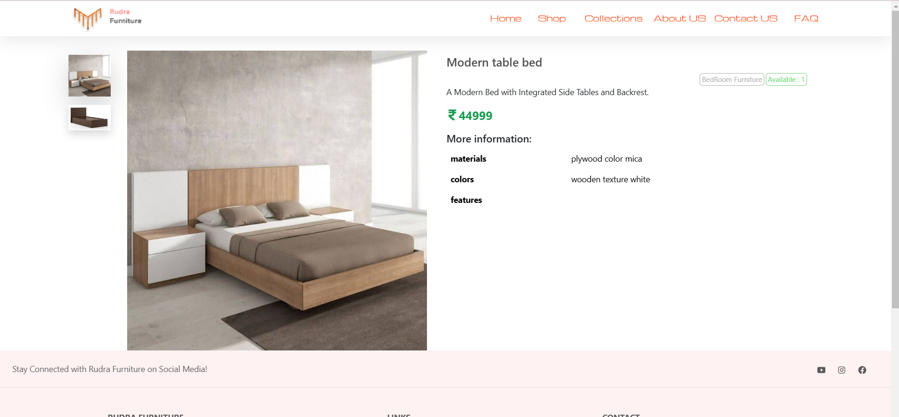

# Rudra Furniture Website

A responsive furniture showcase website developed using **HTML**, **CSS**, **Bootstrap**, **JavaScript**, **TypeScript**, and **Next.js**. It features a detailed product catalog with price ranges, category browsing, and contact forms for customer inquiries. The website emphasizes user-friendly navigation, offering a smooth and personalized customer experience.

## Features

- Product catalog with furniture categories
- Contact form for inquiries
- FAQ section for common questions
- Mobile responsive and user-friendly design

## Pages

### Landing Page


### Collections Page


### Shop Page (Desktop)


### Shop Page (Mobile)
<div style="display: flex; justify-content: space-between;">
  
  
</div>

### Product View Page (Desktop)



## Technologies Used

- **HTML**
- **CSS**
- **Bootstrap**
- **TypeScript**
- **Next.js**

## Setup Instructions

1. Clone the repository:

   ```bash
   git clone https://github.com/harrycoder1/rudrafurniture.git
   cd rudrafurniture
